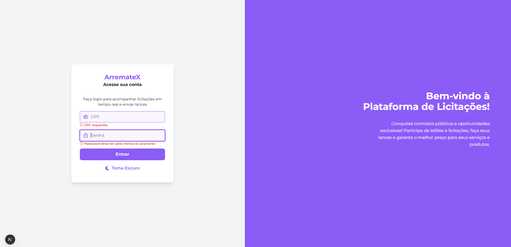
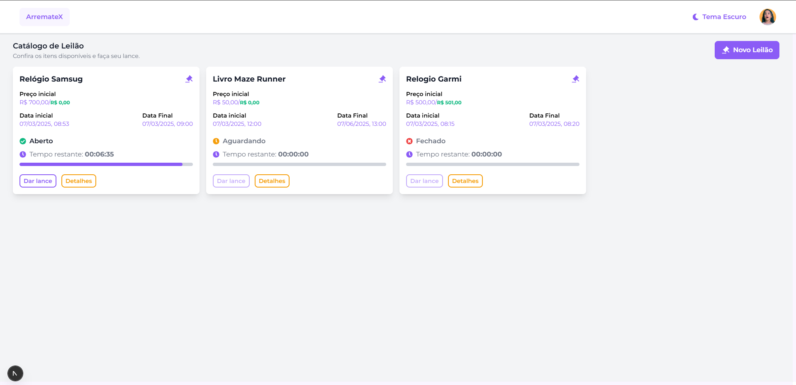
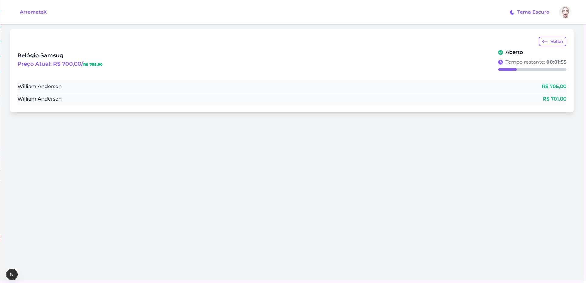
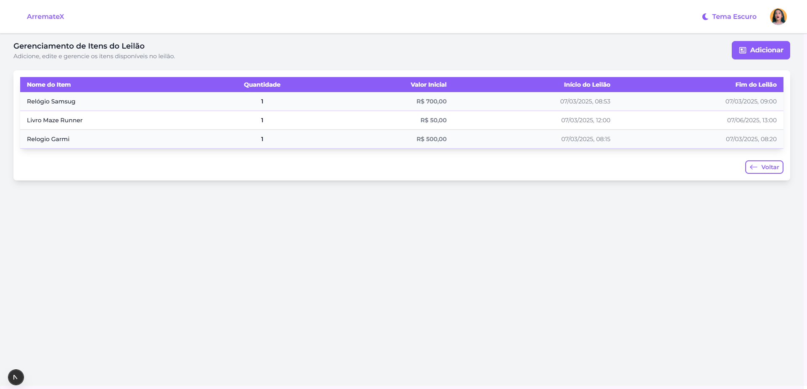
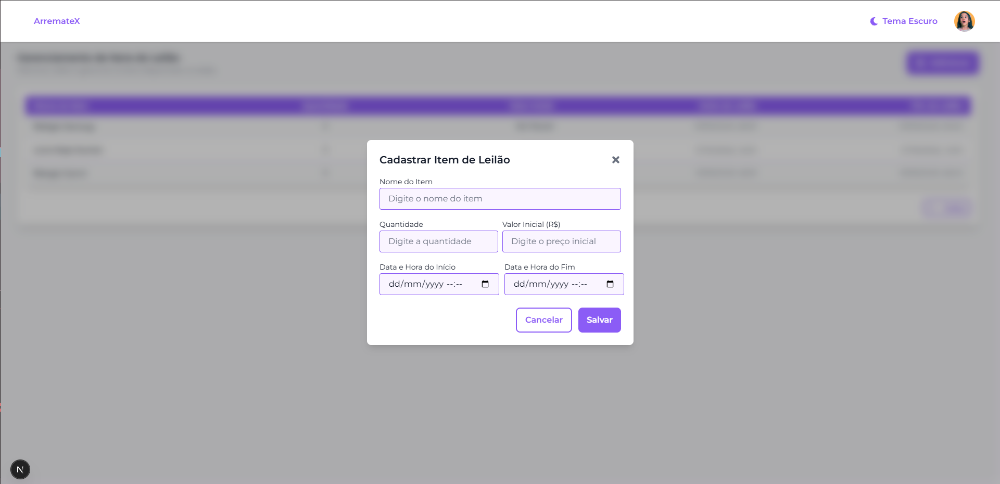

# Leilão Online - Desafio Técnico

Este projeto é um mini sistema de leilão online em tempo real, desenvolvido como parte de um teste de aptidão técnica. Ele permite que usuários participem de leilões de forma dinâmica e transparente, garantindo uma experiência fluida e segura. Administradores podem criar e gerenciar leilões, enquanto os participantes fazem lances em tempo real.

### Login e Leilão



### Leilão



### Detalhes do Leilão



### Painel Administrativo



### Painel Administrativo (Adicionar leilão)



## Tecnologias Utilizadas

### Frontend:

- **Next.js** - Framework React para renderização no servidor (SSR) e geração estática (SSG)
- **React** - Biblioteca para construção de interfaces interativas
- **Tailwind CSS** - Framework CSS utilitário para estilização rápida
- **React Query** - Gerenciamento de estados assíncronos e cache de dados
- **React Hook Form** - Gerenciamento de formulários eficiente e performático
- **Zod** - Validação de dados com schemas flexíveis
- **Socket.IO Client** - WebSockets para comunicação em tempo real

### Backend:

- **Nest.js** - Framework Node.js para desenvolvimento escalável
- **Socket.IO** - Implementação de WebSockets para interações dinâmicas
- **Prisma ORM** - Gerenciamento de banco de dados com tipos seguros
- **JWT (JSON Web Token)** - Autenticação segura e baseada em tokens
- **Bcrypt** - Criptografia segura para senhas dos usuários

## Usuários para Testes

A tabela abaixo apresenta os usuários pré-cadastrados no sistema para fins de testes:

| ID   | Nome Completo    | CPF         | Senha  | Role  |
| ---- | ---------------- | ----------- | ------ | ----- |
| UUID | William Anderson | 12345678909 | 123456 | ADMIN |
| UUID | John Smith       | 31674099088 | 123456 | USER  |
| UUID | Emily Johnson    | 45544995028 | 123456 | USER  |
| UUID | Michael Brown    | 00045353085 | 123456 | USER  |
| UUID | Sophia Wilson    | 97558955076 | 123456 | USER  |

**Observações:**

- Os IDs são gerados automaticamente como UUIDs.
- Os CPFs são fictícios, criados apenas para fins de teste.
- As senhas estão criptografadas no banco de dados, mas o valor original para login é `123456`.

## Funcionalidades

1. **Login**

   - Autenticação segura via CPF e senha
   - Redirecionamento para a página inicial

2. **Listagem de Leilões**

   - Exibição de leilões disponíveis com detalhes essenciais:
     - Nome do item
     - Preço inicial
     - Status do leilão (Aguardando, Aberto, Encerrado)
     - Contagem regressiva para o término

3. **Cadastro de Leilão** (Apenas administradores)

   - Campos obrigatórios:
     - Nome do item
     - Quantidade
     - Valor inicial
     - Data/hora de início e fim
   - Validação via React Hook Form e Zod

4. **Detalhes do Leilão**

   - Nome do item, preço atual, lista de lances em tempo real e tempo restante
   - Exibição clara das informações para melhor tomada de decisão

5. **Envio de Lances**

   - Apenas permitido para leilões abertos
   - O valor do lance deve ser maior que o valor atual
   - Intervalo de 5 segundos entre lances do mesmo participante
   - O leilão é encerrado automaticamente após 2 minutos sem lances

6. **Painel Administrativo**

   - Administradores podem visualizar e gerenciar leilões ativos e finalizados
   - Gerenciamento de participantes e lances em tempo real

7. **Notificações em Tempo Real**

   - Atualização automática da lista de lances
   - Notificações imediatas para novos lances
   - Exibição do vencedor ao encerrar o leilão

## Instalação e Execução

### Clone o Repositório

```bash
git clone git@github.com:augustojaml/test-smartse.git
cd test-smartse
```

### Backend:

#### Requisitos:

- Docker e Docker Compose instalados

```bash
# Acesse a pasta do backend
cd back-nest

# Instale as dependências
npm install

# Copie o arquivo de variáveis de ambiente e ajuste os valores necessários
cp .env.example .env

# Rodar o Docker Compose
docker compose up -d

# Gerar o cliente Prisma
npm run prisma generate

# Rodar migrations do Prisma
npm run prisma migrate dev

# Gerar os usuários iniciais
npm run prisma:seed

# Executar servidor
npm run start:dev
```

### Frontend:

```bash
# Voltar para a pasta raiz
cd ..

# Acesse a pasta do frontend
cd front-next

# Instale as dependências
npm install

# Copie o arquivo de variáveis de ambiente e ajuste os valores necessários
cp .env.example .env.local

# Execute a aplicação
npm run dev
```

## Testes (Apenas no Backend)

Para rodar os testes unitários no backend:

```bash
npm test
```

## Envio do Teste

O projeto deve ser disponibilizado em um repositório público no GitHub e enviado para o email `contratacaosmartse@gmail.com` até o dia **09/03/2025, às 23h59**.
